# 🌌 Helios (ARIA IDE) | Premium AI-Native Code Editor

<p align="center">
  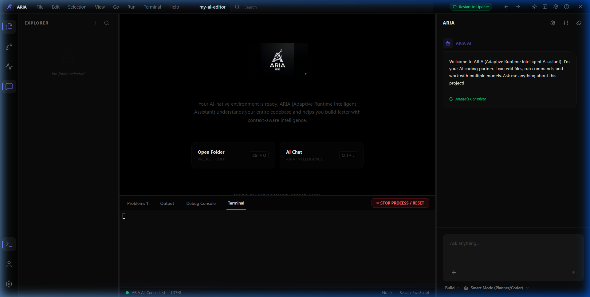
</p>

<p align="center">
  
  
  
  
</p>

**Helios (ARIA - Adaptive Runtime Intelligent Assistant)** is a premium, high-performance, AI-native IDE built from the ground up to integrate deep workspace analysis with state-of-the-art Large Language Models. Featuring a tailored high-contrast dual-dark aesthetic (Pure Black / Deep Charcoal) and micro-animations, Helios makes development faster, more intelligent, and visually immersive. It serves as a fully featured, free desktop alternative to Cursor, Trae, and Claude Code.

---

## 🎬 Startup Experience & Animation

Helios opens with a fluid start-up animation screen that sets a premium, futuristic tone before seamlessly loading the workspace environment.

<p align="center">
  <video src="assets/start-animation.mp4" width="100%" controls autoplay loop muted></video>
</p>

---

## ✨ Key Features & Capabilities

### 1. 🤖 Multi-Model Comparative Chat & Smart Mode
*   **Parallel Execution Comparison**: Query multiple AI models at once and view their responses side-by-side inside high-contrast comparative workspace panels. Ideal for comparing output quality or speed between models.
*   **Smart Mode (Planner/Coder/Reviewer)**: Toggle Smart Mode to run a multi-stage agentic pipeline. The AI will plan the architecture first, write the code, and perform a security/bug check review automatically.
*   **Three-Agent Agentic Pipeline**: Deploy a cooperative development workflow where separate models act as the **Planner**, **Coder**, and **Reviewer** sequentially.
    *   *Planner*: Designs the architecture and layout steps.
    *   *Coder*: Writes and modifies the codebase.
    *   *Reviewer*: Inspects security, checks bugs, and suggests styling/performance enhancements.

<p align="center">
  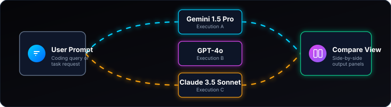
</p>

<p align="center">
  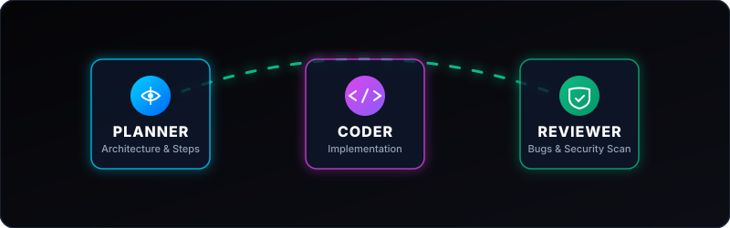
</p>

<p align="center">
  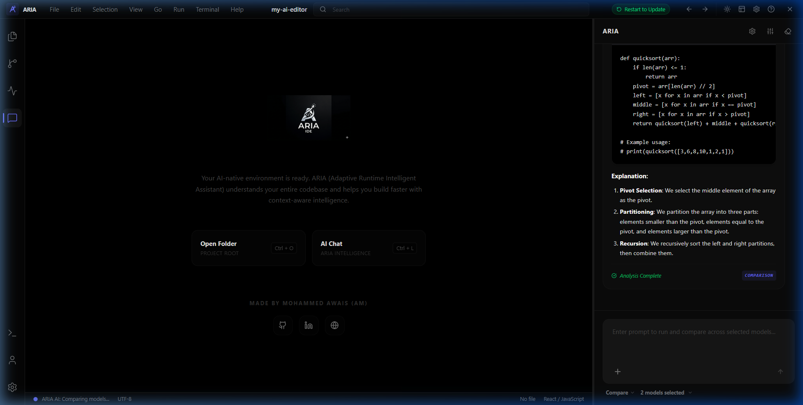
</p>

<p align="center">
  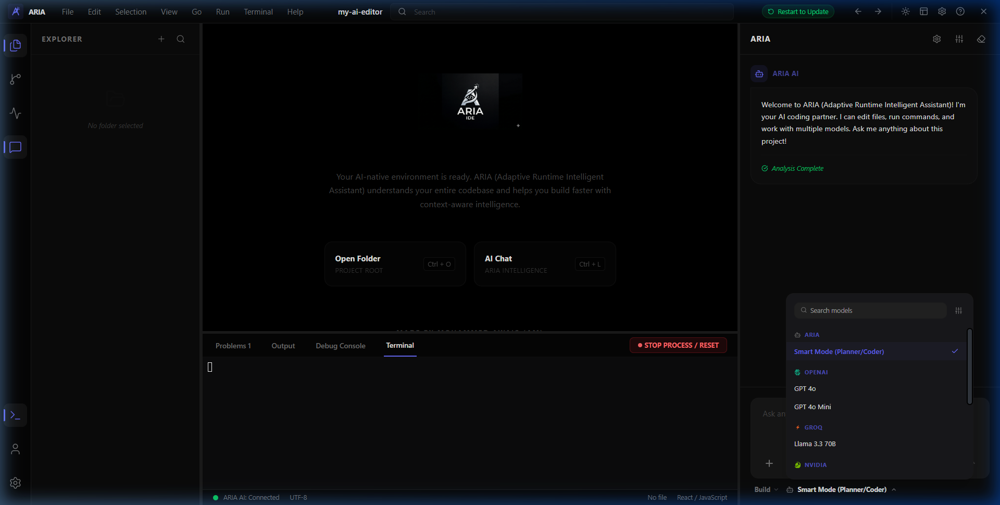
</p>

### 2. ⚙️ Connect Provider Popup Overlay & Advanced Settings
*   **API Providers**: Search and connect from over 100+ pre-configured AI providers (OpenAI, Anthropic, DeepSeek, Google Gemini, Groq, OpenRouter, NVIDIA NIM, and more) or connect custom manual endpoints.
*   **Model Priorities**: Custom-tune which models are preferred for specific workflows like planning, coding, chatting, or reviewing.
*   **MCP Servers (Model Context Protocol)**: Connect external MCP servers to extend the AI's capabilities, allowing it to interact directly with databases, external APIs, and local systems.

<p align="center">
  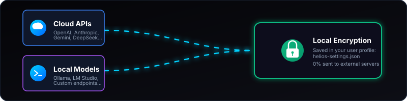
</p>

<p align="center">
  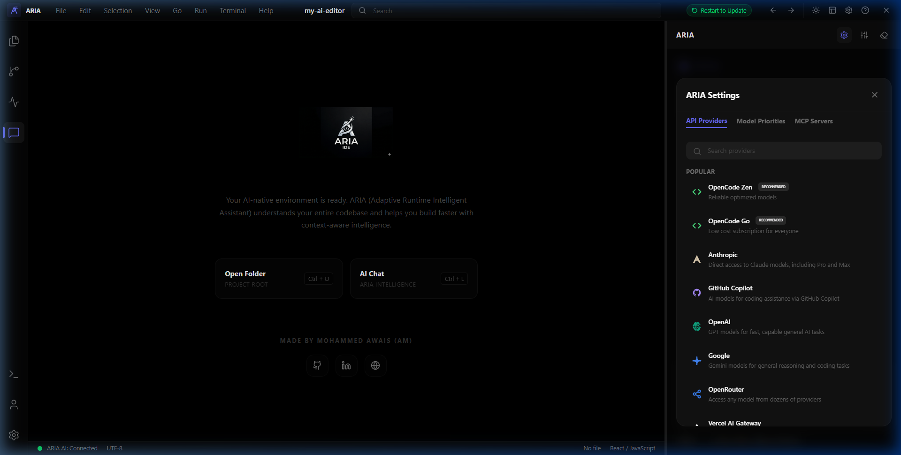
</p>

<p align="center">
  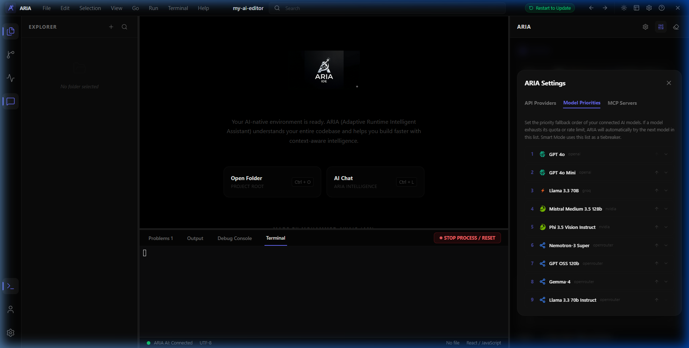
</p>

<p align="center">
  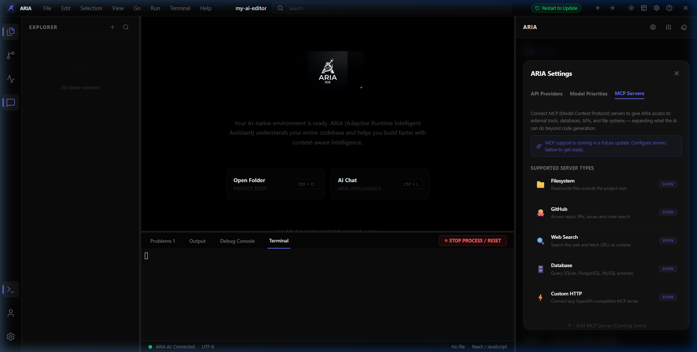
</p>

### 3. 🌀 Dynamic Model Fetching
*   Connect custom API endpoints (e.g., Ollama, LM Studio, or local setups) and automatically query the `/v1/models` endpoint using standard Bearer tokens.
*   Automatically populates 100% of custom local and remote models dynamically inside the workspace selection panel.

### 4. 🎛️ AI Commands & File Writing
*   Helios's AI agent can propose modifications, create new files, and automatically run shell commands via the integrated, interactive terminal to verify code.

### 5. 💻 High-Contrast Editor Canvas
*   Professional-grade code compilation powered by **Monaco Editor** under a premium layout.
*   Supports toggling between an ultra-sleek **Pure Black** layout (`#000000`) and a **Deep Charcoal** GitHub-like styling (`#0d1117`) via a single toggle button in the header.

### 6. 🐚 Fully Interactive Shell Terminal
*   Runs a fully featured terminal session built with `xterm.js` and `wait-on`, with automatic resizing (Fit addon) and a "Stop Process / Reset" control to terminate running scripts.

---

## 📖 How to Use (Step-by-Step Guide)

Follow this detailed workflow to set up, configure, and code with ARIA IDE:

---

### 📂 Step 1: Run the IDE & Open a Workspace
1. **Launch ARIA**: Extract the `ARIA-Portable.zip` file and double-click **`ARIA.exe`** inside the `ARIA-win32-x64` folder.
2. **Load Project**: Click **File > Open Folder...** (or press `Ctrl + Shift + O`) and select your project's directory.
3. **Workspace Indexing**: Once loaded, ARIA starts indexing your codebase. It scans files and functions to build a local context database, which the AI models utilize to provide highly accurate, context-aware answers.

---

### 🔑 Step 2: Configure AI Keys & Custom Endpoints
1. **Open Settings**: Click the **Settings Gear Icon** in the top-right corner of the header.
2. **Select Provider**: Choose from the list of 100+ supported AI providers (e.g. OpenAI, Anthropic, Gemini, Groq, DeepSeek).
3. **Pasting Keys**: Paste your API key in the password field and click **Continue**. Your keys are encrypted and stored safely on your local machine (`helios-settings.json`).
4. **Local / Custom Models**: If using Ollama or LM Studio, toggle the **Custom Endpoint** switch, paste your local server URL (e.g. `http://localhost:11434/v1`), and ARIA will dynamically fetch all models running on your machine.

<p align="center">
  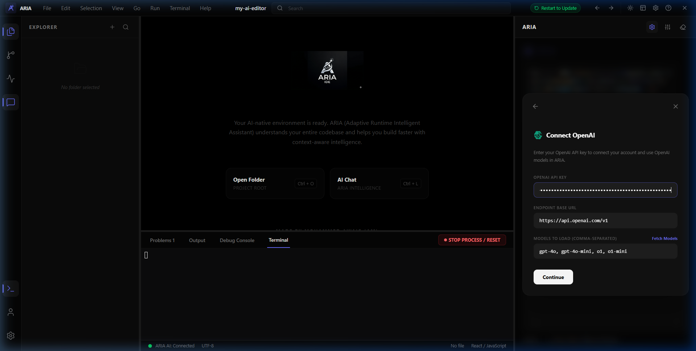
</p>

---

### ⚙️ Step 3: Set Model Priorities & MCP Servers (Optional)
1. **Set Priorities**: Click the **Model Priorities** tab in settings to map specific models to different agent roles. For example, assign `claude-3-5-sonnet` for Coder operations and `gpt-4o` for Planning.
2. **Connect MCP Servers**: Click the **MCP Servers** tab to add Model Context Protocol endpoints. This integrates external systems (databases, command-line utilities, search APIs) directly into the AI's tool belt.

---

### 🤖 Step 4: Prompting, Comparative Chat & Smart Mode
1. **Toggle Chat**: Open the chat sidebar using `Ctrl + L` or clicking the chat icon in the sidebar.
2. **Select Models**: Use the dropdown at the top of the chat to select your active model(s).
3. **Comparative Chat**: Click **Compare Mode** to select two models (e.g. Gemini 1.5 Pro vs GPT-4o). Submit your prompt, and watch both models execute and print outputs side-by-side in high-contrast panels.
4. **Agentic Smart Mode**: Select **Smart Mode** from the bottom selector. Enter your request (e.g., "Add user authorization to my server"). ARIA will deploy a three-stage agent workflow:
   - **Planner**: Outlines the code changes and architecture.
   - **Coder**: Modifies files and writes the implementation.
   - **Reviewer**: Tests, scans for bugs, and validates the styling and security.

---

### 🐚 Step 5: Code Editing & Terminal Verification
1. **Code with Monaco**: Open any file from the explorer sidebar (`Ctrl + B`) to edit code with full syntax highlighting, brackets matching, and parameter hints.
2. **Run Code**: Press **`F5`** (or click **Run > Run Active File**). ARIA will automatically identify the programming language (`.js`, `.py`, `.go`, `.rs`, `.cpp`, etc.) and execute the appropriate compilation or run command inside the interactive terminal.
3. **Manage Processes**: Use the **`STOP PROCESS / RESET`** button in the terminal panel to kill long-running loops or terminate active dev servers.

---

---

## 💻 Keyboard Shortcuts

| Shortcut | Description |
|---|---|
| `Ctrl + N` | Create a New File |
| `Ctrl + O` | Open a File |
| `Ctrl + Shift + O` | Open a Folder / Workspace |
| `Ctrl + S` | Save Current File |
| `Ctrl + Shift + S` | Save File As |
| `Ctrl + B` | Toggle File Explorer Sidebar |
| `Ctrl + \`` (backtick) | Toggle Shell Terminal Panel |
| `Ctrl + L` | Toggle AI Chat Sidebar |
| `Ctrl + G` | Go to Line / File |
| `F5` | Run Active File / Start Debugging |
| `F12` | Go to Symbol Definition / Toggle DevTools |
| `Ctrl + =` | Zoom In Workspace |
| `Ctrl + -` | Zoom Out Workspace |
| `Ctrl + 0` | Reset Zoom |

---

## 🔒 Code Security & Packaging Pipeline

To protect developer attribution and enforce runtime integrity:
*   **Active main.js Obfuscation**: The packager compiles and scramble-obfuscates `main.js` backend scripts, making decompilers useless.
*   **Self-Defending Modules**: Anti-tampering features prevent code formatting or unauthorized credit edits by causing the app to freeze/crash on modification.
*   **Encrypted Strings**: Credit signatures are scrambled with Base64 key tables.

---

## 🛠️ Project Architecture

```text
Helios/
├── assets/            # Workspace previews, screenshots & start animation video
├── services/          # Backend modules (Git integration, codebase indexing)
├── src/
│   ├── components/    # React Workspace layout, Settings modal, comparative views
│   ├── styles/        # Pure black stylesheets & animations
│   ├── App.jsx        # Core UI & state controller
│   └── main.jsx       # Client entrypoint
├── main.js            # Electron Main controller (CommonJS)
├── preload.js         # Context bridge
└── package.js         # Obfuscation & packing script
```

---

## 🚀 Getting Started (Portable Release)

No installation or node setup is required! ARIA is distributed as a pre-packaged portable Windows application.

### Running the App:
1. Locate the `ARIA-Portable.zip` file in the root of the repository (or download it).
2. Extract the ZIP file's contents to a folder on your computer.
3. Open the extracted folder `ARIA-win32-x64` and run **`ARIA.exe`** to launch the editor immediately.


---

## 🎁 Free & Paid API Provider Guide

To help you get started with zero cost, here are the best ways to obtain free or low-cost API keys to power ARIA IDE:

<p align="center">
  
</p>

### 1. 🟢 NVIDIA NIM (Highly Recommended)
*   **What you get**: Free trial credits upon sign-up, giving access to **120+ state-of-the-art models** (including Llama 3, Gemma 2, Mistral, Nemotron, etc.) with ultra-fast latency.
*   **How to set up**:
    1. Visit [build.nvidia.com](https://build.nvidia.com/).
    2. Log in and generate a single API Key.
    3. Paste this key into ARIA's **NVIDIA NIM** provider settings to instantly unlock all 120+ models.

### 2. 🟢 OpenRouter (Free + Paid)
*   **What you get**: A unified API endpoint for almost every model in existence. OpenRouter offers **several high-performance models for 100% free** (like Llama 3 8B, Gemini 1.5 Flash - free tier, etc.) as well as pay-as-you-go access to Claude, GPT-4, and DeepSeek.
*   **How to set up**:
    1. Sign up at [openrouter.ai](https://openrouter.ai/).
    2. Create a key and paste it into ARIA's **OpenRouter** settings.

### 3. 🟢 Groq (High Speed Free Tier)
*   **What you get**: Instant, blazing-fast access to open-source models (Llama 3 70B/8B, Mixtral 8x7B, Gemma 2) at up to 800 tokens/sec. It has a **generous free tier** with rate limits.
*   **How to set up**:
    1. Sign up at [console.groq.com](https://console.groq.com/).
    2. Go to **API Keys**, generate one, and paste it into ARIA's **Groq** provider settings.

### 4. 🟢 Google Gemini (Free via AI Studio)
*   **What you get**: Free rate-limited API access to Gemini 1.5 Pro and Gemini 1.5 Flash.
*   **How to set up**:
    1. Go to [aistudio.google.com](https://aistudio.google.com/).
    2. Create an API Key and paste it into ARIA's **Google** provider settings.

### 5. 🟢 Local LLMs (100% Free & Offline)
*   **What you get**: Run models like Llama 3, Qwen, or Mistral entirely locally on your own graphics card or CPU with absolute privacy and zero cost.
*   **How to set up**:
    1. Download [Ollama](https://ollama.com/) or [LM Studio](https://lmstudio.ai/).
    2. Run your preferred model (e.g. `ollama run llama3`).
    3. In ARIA, open settings, toggle **Custom Endpoint**, enter your local URL (e.g. `http://localhost:11434/v1`), and ARIA will dynamically fetch your local models!

---

## 📜 Attribution & Credits

Created with ❤️ by **Mohammed Awais (AM)**.

*This project is distributed for educational and development purposes. Unauthorized modifications of developer attributions or removal of credit signatures are strictly prohibited by the application's built-in self-defense and integrity mechanisms.*
